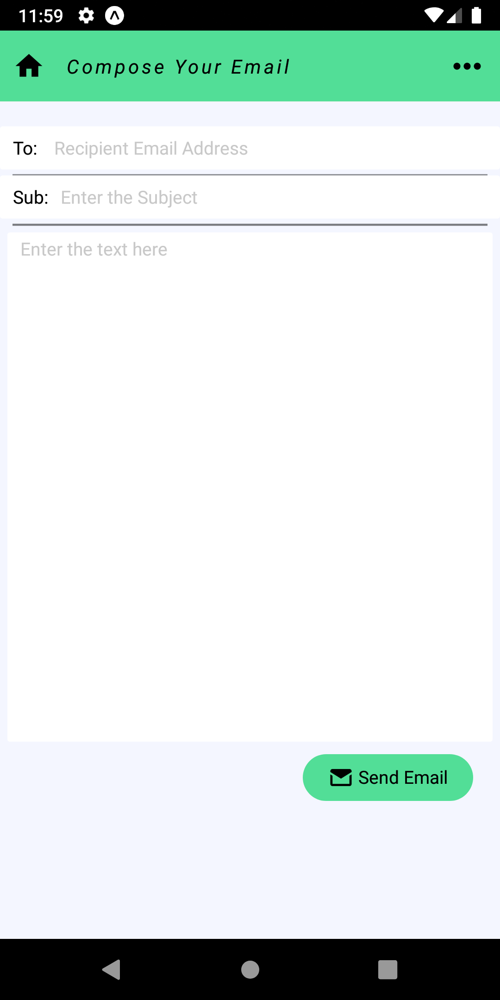
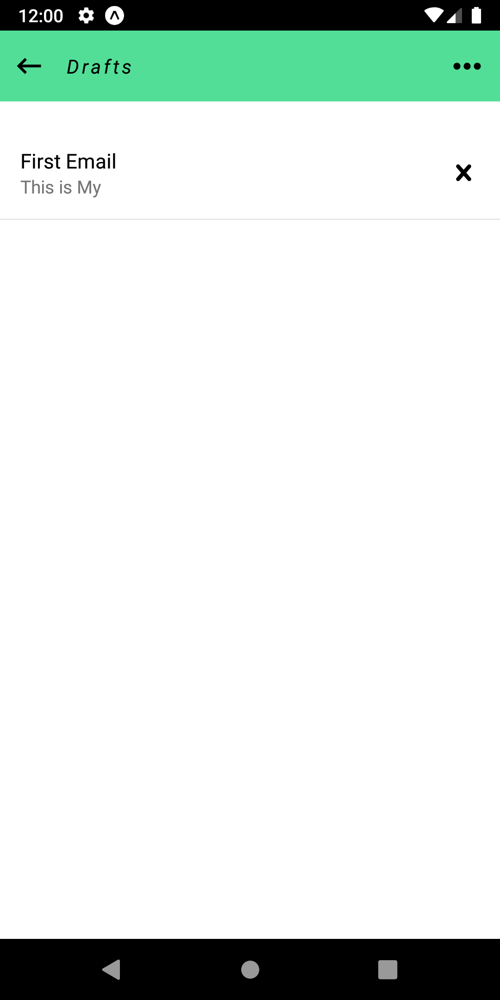

# Email-Editor
An Email Editor with Next Word Prediction

## How to Run this Website
1. Clone this Repo to your Local Machine.
2.Open the Terminal in Client and backend folder.
3. Type ```npm start``` in the Client Folder Terminal and ```pip install -r requirements.txt``` in backend folder Terminal.
4. Download the Expo App from Play Store.
5. Scan the Qr Code shown in the Client Folder Terminal.
6. Enjoy!!! :tada: :sparkles:

## Images

Intro Page             |  Email Composer Page | Next Word Suggestion and Save to Draft | Drafts
:-------------------------:|:-------------------------:|:-------------------------:|:-------------------------:|
 |  | | 


